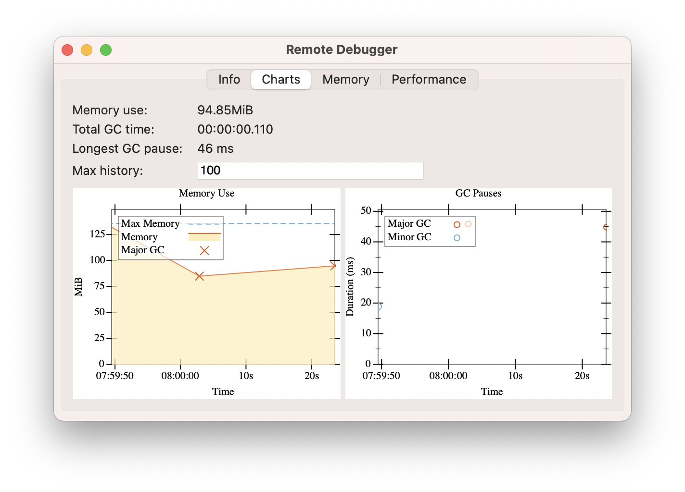

# dbg

A server, client and UI for remotely debugging Racket applications.
Very much a work in progress.



## Usage
### Run a server

```racket
(require debugging/server)
(serve)
```

### Run the UI

    racket -l debugging/ui

## License

    dbg is licensed under the 3-Clause BSD license.
